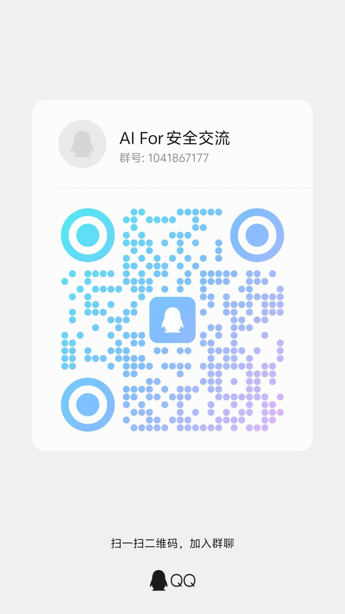

# Agentic IDA Pro

一个面向 **IDA Pro 9.3** 的 LLM 主导逆向分析平台，聚焦“结构体恢复 + 攻击面发现 + 通用逆向分析”。

---

## 1. 项目定位

本项目不是“脚本硬编码控制器”，而是 **LLM 驱动的 tool-call loop**：

- 规划由 LLM 完成
- 执行由工具完成
- 状态由任务板与知识库驱动
- 输出为纯文本/Markdown（避免强格式约束）

核心场景：

- 入口与热点函数定位（`search` / `xref`）
- 关键函数伪代码证据采集（`decompile_function` / `inspect_variable_accesses`）
- 结构体创建与迭代（`create_structure`）
- 类型应用与重反编译验证（`set_identifier_type`）
- 攻击面入口点识别与分类（`search` / `xref` / `expand_call_path`）
- 自主函数优先级排序与行为归纳（`list_functions` / `spawn_subagent`）
- 任务闭环与证据链输出（`create_task` / `set_task_status` / `submit_output`）

---

## 2. 核心特性

- LLM 主导单循环：观察 -> 规划 -> 调工具 -> 取证 -> 更新任务/知识 -> 再决策
- 统一主 Runtime：`struct_recovery` / `attack_surface` / `general_reverse` 共用一个 loop
- 结构体恢复强约束：只允许通过 `create_structure` 建模
- 强制验证闭环：结构体创建后必须类型应用并重反编译
- 任务板原生支持：`todo/in_progress/blocked/done` 可追踪
- 会话可观测性：SQLite 持久化 turn/message/tool/event
- 证据驱动评测：自动沉淀 `run_trace.md` / `evidence.md` / `verdict.md`

---

## 3. 架构概览

### 3.1 整体架构

```text
User Request
   |
   v
reverse_agent.py (统一入口)
   |
   v
reverse_agent_service.py (服务管理层)
   |
   +-- 启动 ida_service.daemon (子进程)
   +-- 调用 reverse_expert.py (主分析流程)
   |
   v
ReverseAgentCore (Profile 分发器)
   |
   +-- struct_recovery  ──┐
   +-- attack_surface   ──┼──> ReverseRuntimeCore (统一运行时)
   +-- general_reverse  ──┘         |
                                    +-- PolicyManager (LLM 策略循环)
                                    +-- TaskBoard (任务管理)
                                    +-- KnowledgeManager (知识库)
                                    +-- SubAgentManager (子 Agent 管理)
                                    +-- ContextDistiller (上下文压缩)
                                    +-- ObservabilityHub (可观测性)
   |
   v
Tool Layer (ExpertToolRegistry)
   |
   +-- search / xref / list_functions
   +-- decompile_function / inspect_variable_accesses
   +-- create_structure / set_identifier_type
   +-- expand_call_path / spawn_subagent
   +-- create_task / set_task_status
   +-- submit_output / submit_attack_surface_output / submit_reverse_analysis_output
   |
   v
IDAClient (HTTP 客户端)
   |
   v
ida_service.daemon (IDA 进程内 HTTP 服务)
   |
   +-- /execute (执行 IDAPython 脚本)
   +-- /decompile (反编译函数)
   +-- /search (搜索符号/字符串)
   +-- /xrefs (交叉引用)
   +-- /db/open|close|backup (数据库管理)
   |
   v
IDB / Hex-Rays / IDA APIs
```

### 3.2 核心组件说明

- **ReverseAgentCore**：Profile 分发器，根据 `--agent-profile` 参数路由到对应的系统提示词（位于 `agent/`）
- **ReverseRuntimeCore**：统一的 LLM 驱动运行时，所有 profile 共享同一个 tool-call loop（位于 `runtime/`）
- **StructRecoveryAgentCore**：结构体恢复特化版本（向后兼容，内部使用 ReverseRuntimeCore）（位于 `agent/`）
- **PolicyManager**：管理 LLM 对话历史、上下文压缩、工具调用循环（位于 `runtime/`）
- **TaskBoard**：任务板管理（todo/in_progress/blocked/done）（位于 `core/`）
- **SubAgentManager**：管理子 Agent 生命周期（函数摘要、参数分析、攻击面分诊等）（位于 `runtime/`）
- **ExpertToolRegistry**：工具注册表，支持 profile 级别的工具过滤（位于 `runtime/`）
- **IDAClient**：IDA Pro HTTP 客户端，负责与 IDA Service 通信（位于 `clients/`）

---

## 4. 仓库结构

```text
.
├── src/
│   ├── agent/                     # Agent 实现（仅包含具体 Agent 类）
│   │   ├── reverse_agent_core.py      # Profile 分发器
│   │   ├── struct_recovery_agent.py   # 结构体恢复特化版本
│   │   └── idapython_agent.py         # IDAPython 任务 Agent
│   ├── runtime/                   # 运行时核心与管理器
│   │   ├── reverse_runtime_core.py    # 统一运行时核心
│   │   ├── subagent_runtime.py        # 子 Agent 运行时
│   │   ├── policy_manager.py          # LLM 策略管理
│   │   ├── prompt_manager.py          # Prompt 模板管理
│   │   ├── knowledge_manager.py       # 知识库管理
│   │   ├── subagent_manager.py        # 子 Agent 生命周期管理
│   │   ├── tool_registry.py           # 工具注册表
│   │   └── context_distiller.py       # 上下文压缩
│   ├── core/                      # 核心工具、模型和基础设施
│   │   ├── models.py                  # 数据模型定义
│   │   ├── tools.py                   # 工具定义与实现
│   │   ├── utils.py                   # 通用工具函数
│   │   ├── task_board.py              # 任务板管理
│   │   ├── session_logger.py          # 会话日志记录
│   │   ├── observability.py           # 可观测性 Hub
│   │   └── idapython_kb.py            # IDAPython 知识库
│   ├── clients/                   # 外部服务客户端
│   │   └── ida_client.py              # IDA HTTP 客户端
│   ├── prompts/                   # 系统提示词与子 Agent 提示词
│   │   ├── agent/                     # 主 Agent 系统提示词
│   │   │   ├── reverse_expert_system.md       # 结构体恢复系统提示词
│   │   │   ├── attack_surface_system.md       # 攻击面分析系统提示词
│   │   │   └── general_reverse_system.md      # 通用逆向系统提示词
│   │   ├── subagents/                 # 子 Agent 提示词
│   │   │   ├── function_summary_agent.md      # 函数摘要 Agent
│   │   │   ├── function_behavior_summary.md   # 函数行为摘要
│   │   │   ├── parameter_control_summary.md   # 参数控制分析
│   │   │   ├── surface_candidate_triage.md    # 攻击面候选分诊
│   │   │   ├── surface_deep_dive.md           # 攻击面深度分析
│   │   │   ├── idapython_executor.md          # IDAPython 执行器
│   │   │   └── ...                            # 其他子 Agent
│   │   ├── distiller/                 # 上下文压缩提示词
│   │   └── fragments/                 # 可复用提示词片段
│   ├── ida_service/               # IDA HTTP 服务（在 IDA 进程内运行）
│   │   ├── daemon.py                  # 服务主入口
│   │   ├── executor.py                # IDAPython 执行器
│   │   ├── search_core.py             # 搜索核心
│   │   └── ...
│   ├── ida_scripts/               # 可复用 IDAPython 脚本模板
│   │   ├── create_structure.py        # 结构体创建
│   │   ├── set_identifier_type.py     # 类型应用
│   │   ├── inspect_variable_accesses.py  # 变量访问分析
│   │   ├── expand_call_path.py        # 调用路径展开
│   │   └── skills/                    # 技能专用脚本
│   ├── entrypoints/               # 启动入口
│   │   ├── reverse_agent_service.py   # 服务管理入口
│   │   ├── reverse_expert.py          # 主分析流程
│   │   ├── logs.py                    # 日志服务
│   │   └── observability_api.py       # 可观测性 API
│   ├── skills/                    # 系统知识类技能（运行时加载）
│   │   ├── struct_recovery/           # 结构体恢复技能
│   │   ├── function_analysis/         # 函数分析技能
│   │   └── string_decrypt/            # 字符串解密技能
├── frontend/observability/        # 可观测性前端 (Vue)
│   ├── src/
│   │   ├── components/                # Vue 组件
│   │   └── ...
│   └── package.json
├── dev_skills/                    # 开发调试类技能（Claude/Codex 共享 skill 源）
│   ├── run-full-system-eval/          # 整系统评测编排
│   ├── live-trace-triage/             # 运行中排障
│   ├── judge-reverse-quality/         # 评判恢复质量
│   └── author-regression-case/        # 沉淀回归 case
├── logs/                          # 会话日志、报告产物
│   ├── agent_reports/                 # Agent 分析报告
│   └── agent_sessions/                # 会话可观测性数据库
└── reverse_agent.py               # 根目录统一入口
```

### 模块职责说明

- **agent/** - 仅包含具体的 Agent 实现类，保持简洁
- **runtime/** - 运行时核心、各种管理器和上下文处理
- **core/** - 数据模型、工具定义、通用工具和基础设施
- **clients/** - 与外部服务交互的客户端（IDA、未来可能的其他服务）

---

## 5. 环境要求

### 5.1 必需

- Python 3.10+（建议）
- IDA Pro 9.3（仅考虑 9.3）
- Hex-Rays 可用（用于反编译）
- 可访问的 OpenAI 兼容 API 服务

### 5.2 可选

- Node.js 18+（可观测性前端）
- WSL + Windows 双端协作（推荐）

---

## 6. 安装

```bash
cd /mnt/d/reverse/agentic_ida_pro
python3 -m venv .venv
.venv/bin/pip install -r requirements.txt
```

---

## 7. LLM 配置

项目强约束模型为 `gpt-5.2`（运行时会校验）。

```bash
export OPENAI_API_KEY='your-api-key-1'
export OPENAI_BASE_URL='http://192.168.72.1:8317/v1'
export OPENAI_MODEL='gpt-5.2'
```

---

## 8. 运行方式（发布版推荐）

### 8.1 一体化入口（推荐）

```bash
cd /mnt/d/reverse/agentic_ida_pro
OPENAI_API_KEY='your-api-key-1' \
OPENAI_BASE_URL='http://192.168.72.1:8317/v1' \
OPENAI_MODEL='gpt-5.2' \
PYTHONPATH=src .venv/bin/python reverse_agent.py \
    --input-path /abs/path/to/target.i64 \
    --request "分析关键函数并恢复结构体定义，给出证据链" \
    --agent-profile struct_recovery \
    --max-iterations 40
```

该入口会：

- 同步 fresh restart 并拉起 observability stack（前端 `5173` / 后端 `8765`）
- 等待 observability API/UI 健康；可自动打开 UI，失败时会打印 `http://127.0.0.1:5173`
- 子进程启动 `ida_service.daemon`
- 调用 `/db/open` 打开目标二进制或 IDB
- 启动并等待 `reverse_expert.py`
- 结束时调用 `/db/close`（默认保存）并回收 service 进程

### 8.2 目录批量分析（异步并发）

```bash
cd /mnt/d/reverse/agentic_ida_pro
OPENAI_API_KEY='your-api-key-1' \
OPENAI_BASE_URL='http://192.168.72.1:8317/v1' \
OPENAI_MODEL='gpt-5.2' \
PYTHONPATH=src .venv/bin/python reverse_agent.py \
    --input-path /abs/path/to/samples \
    --recursive \
    --file-pattern '*.i64' \
    --file-pattern '*.exe' \
    --concurrency 3 \
    --ida-port 5000 \
    --request "批量分析并恢复关键结构体，输出证据链" \
    --agent-profile struct_recovery \
    --max-iterations 40
```

说明：

- 建议统一使用 `--input-path`，当该路径是目录时自动进入批量模式
- `--input-dir` 仍可用，但仅作为 `--input-path` 的兼容别名
- 批量模式下 observability 只在父流程启动一次，worker 子进程不会重复重启 UI
- 批量模式下端口为动态分配（从 `--ida-port` 起寻找可用端口），避免并发冲突
- 建议端口区间预留充足，避免与本机其他服务冲突

### 8.3 Profile 选择

```bash
# 结构体恢复（默认）
PYTHONPATH=src .venv/bin/python reverse_agent.py \
    --input-path /abs/path/to/target.i64 \
    --request "恢复关键结构体并完成类型应用验证" \
    --agent-profile struct_recovery

# 攻击面分析
PYTHONPATH=src .venv/bin/python reverse_agent.py \
    --input-path /abs/path/to/target.i64 \
    --request "识别外部可达入口点、分类并评估风险" \
    --agent-profile attack_surface

# 通用逆向
PYTHONPATH=src .venv/bin/python reverse_agent.py \
    --input-path /abs/path/to/target.i64 \
    --request "自主探索程序功能、攻击面和关键函数" \
    --agent-profile general_reverse
```

#### Profile 详细说明

**1. struct_recovery（结构体恢复）**
- **目标**：恢复二进制中的结构体定义，提升反编译可读性
- **系统提示词**：`prompts/agent/reverse_expert_system.md`
- **核心工具**：`create_structure`、`set_identifier_type`、`inspect_variable_accesses`
- **工作流程**：
  1. 搜索关键函数（`search`/`xref`）
  2. 反编译并分析变量访问（`decompile_function`/`inspect_variable_accesses`）
  3. 创建结构体定义（`create_structure`）
  4. 应用类型并重反编译验证（`set_identifier_type`）
  5. 写入函数注释（`set_function_comment`）
  6. 提交最终输出（`submit_output`）
- **验收标准**：before/after 结构体 diff、有效 mutation 计数、类型应用验证
- **适用场景**：需要深度理解数据结构、提升代码可读性、辅助漏洞分析

**2. attack_surface（攻击面分析）**
- **目标**：识别外部可达入口点，评估攻击面风险
- **系统提示词**：`prompts/agent/attack_surface_system.md`
- **核心工具**：`search`、`xref`、`expand_call_path`、`spawn_subagent`
- **子 Agent**：
  - `surface_candidate_triage`：候选入口点分诊
  - `surface_deep_dive`：深度分析入口点上下文
  - `parameter_control_summary`：外部参数控制分析
- **工作流程**：
  1. 粗粒度搜索（网络/文件/IPC/驱动接口）
  2. 候选分诊（spawn subagent 批量筛选）
  3. 深度细化（调用链展开、参数追踪）
  4. 分类评估（风险等级、触发方法）
  5. 提交攻击面地图（`submit_attack_surface_output`）
- **完成标准**：至少 5 个入口点（或说明样本限制）、每个入口点包含触发方法与外部参数
- **适用场景**：安全审计、漏洞挖掘、威胁建模

**3. general_reverse（通用逆向分析）**
- **目标**：自主探索二进制功能、攻击面、外部交互与关键函数
- **系统提示词**：`prompts/agent/general_reverse_system.md`
- **核心工具**：`list_functions`、`search`、`xref`、`expand_call_path`、`spawn_subagent`
- **子 Agent**：
  - `function_behavior_summary`：函数行为归纳
  - `parameter_control_summary`：参数控制分析
  - `surface_candidate_triage`：攻击面候选筛选
- **工作流程**：
  1. 概览阶段（`list_functions`、函数分类）
  2. 攻击面识别（搜索外部接口）
  3. 优先级排序（基于调用频率、字符串、导入符号）
  4. 深度分析（spawn subagent 批量摘要）
  5. 综合阶段（`expand_call_path` 收敛关键调用链与模块关系）
  6. 提交阶段（`submit_reverse_analysis_output`）
- **完成标准**：函数列表摘要、攻击面列表、外部交互文档、不超过 20 个关键函数详细摘要
- **提交纪律**：
  - 进入综合阶段后，目标是整理已有证据并完成最终提交，不再为次要补证无限扩张搜索面
  - 如果任务板只剩综合/提交任务，或连续一轮没有新增关键证据，应优先提交阶段性最终结果
  - 允许带着明确缺口说明提交，不要求“完全覆盖后再 submit”
- **适用场景**：初次接触未知二进制、快速功能定位、全局威胁评估

#### Profile 架构统一说明

所有 profile 共享同一个 `ReverseRuntimeCore`，差异仅在于：
- **系统提示词**：不同的分析目标与执行协议
- **工具过滤**：部分 profile 可能限制某些工具的可见性
- **finalize 工具**：
  - `struct_recovery` → `submit_output`
  - `attack_surface` → `submit_attack_surface_output`
  - `general_reverse` → `submit_reverse_analysis_output`
- **子 Agent 配置**：不同 profile 使用不同的子 Agent 提示词组合

### 8.4 仅启动 IDA Service（可选）

```bash
cd /mnt/d/reverse/agentic_ida_pro
bash src/entrypoints/run_ida_service.sh
```

若设置 `IDA_DEFAULT_INPUT_PATH`，service 启动时会自动打开；未设置时可后续调用 `/db/open`。

---

## 9. 关键脚本说明

### 9.1 `src/entrypoints/reverse_expert.py`

职责：

- 执行完整 Agent 循环
- 汇总运行证据并输出 `run_trace.md`、`evidence.md`
- 在评测模式下接收 case 级上下文并注入主请求
- 输出 profile 对应的最终文本结果与报告产物

关键参数：

- `--request`：任务描述（必填）
- `--ida-url`：IDA service 地址，默认 `http://127.0.0.1:5000`
- `--max-iterations`：循环上限，默认 24
- `--agent-profile`：主分析 profile（`struct_recovery` / `attack_surface` / `general_reverse`）
- `--agent-core`：兼容参数，当前统一走通用 runtime
- `--idapython-kb-dir`：IDAPython 自修复知识库（可选）
- `--report-dir`：报告目录（默认 `logs/agent_reports`）
- `--case-id`：评测 case 标识（可选）
- `--case-spec-path`：评测 case 说明 markdown 路径（可选）
- `--evidence-function`：优先补证的关键函数名，可重复传入（可选）

### 9.2 `reverse_agent.py`（根目录入口）

职责：

- 根路径统一入口，调用 `src/entrypoints/reverse_agent_service.py`
- 对外保持简洁启动命令，不暴露内部脚本层级

### 9.3 `src/entrypoints/reverse_agent_service.py`（内部实现）

职责：

- 统一入口：拉起 `ida_service` 子进程并等待健康检查
- 调用 `open_database`/`close_database` 动态开关 IDB
- 在当前进程直接调用 `reverse_expert` 能力（不再脚本子进程嵌套）

常用参数：

- `--input-path`：统一输入路径；文件=单目标模式，目录=批量模式
- `--input-dir`：兼容别名（建议改用 `--input-path`）
- `--concurrency`：批量并发 worker 数（每个 worker 启动一个独立 ida_service）
- `--file-pattern`：批量模式 glob 过滤（可重复）
- `--request`：逆向任务描述（必填）
- `--ida-host/--ida-port`：service 绑定地址
- `--no-save-on-exit`：退出时关闭数据库不保存
- `--case-id`：把评测 case 标识透传给 runtime，便于 run_trace / evidence 对齐
- `--case-spec-path`：把 case 规范文本路径透传给 runtime，收紧目标与验收边界
- `--evidence-function`：指定优先反编译/补证的函数名，减少短预算下的上下文漂移

### 9.4 `src/entrypoints/run_ida_service.sh`（纯 Linux 方案）

如果只想单独启动 service，可直接：

```bash
export IDA_DEFAULT_INPUT_PATH=/abs/path/to/target.i64
bash src/entrypoints/run_ida_service.sh
```

---

## 10. 子 Agent 系统

### 10.1 子 Agent 概述

主 Agent 可以通过 `spawn_subagent` 工具启动子 Agent 来并行处理批量任务，例如：
- 批量函数摘要生成
- 攻击面候选入口点分诊
- 参数控制流分析
- 函数行为归纳

子 Agent 特点：
- **独立上下文**：每个子 Agent 有独立的 LLM 对话上下文，不污染主 Agent
- **专用提示词**：使用专门的子 Agent 系统提示词（位于 `src/prompts/subagents/`）
- **工具子集**：子 Agent 只能访问受限的工具集（通常是只读工具）
- **结果聚合**：子 Agent 完成后，结果返回给主 Agent 进行决策

### 10.2 可用子 Agent 类型

| 子 Agent 类型 | 提示词文件 | 用途 | 主要工具 |
|--------------|-----------|------|---------|
| `function_summary_agent` | `function_summary_agent.md` | 通用函数摘要 | `decompile_function`, `xref` |
| `function_behavior_summary` | `function_behavior_summary.md` | 函数行为归纳 | `decompile_function`, `expand_call_path` |
| `parameter_control_summary` | `parameter_control_summary.md` | 参数控制分析 | `decompile_function`, `inspect_variable_accesses` |
| `surface_candidate_triage` | `surface_candidate_triage.md` | 攻击面候选分诊 | `decompile_function`, `xref` |
| `surface_deep_dive` | `surface_deep_dive.md` | 攻击面深度分析 | `decompile_function`, `expand_call_path` |
| `idapython_executor` | `idapython_executor.md` | IDAPython 脚本执行 | `run_idapython_task` |

### 10.3 子 Agent 使用示例

```python
# 主 Agent 调用 spawn_subagent 工具
spawn_subagent(
    subagent_type="function_behavior_summary",
    task_description="分析函数 sub_1234 的行为，关注网络调用和参数传递",
    context_data={
        "function_name": "sub_1234",
        "function_address": "0x1234",
        "decompiled_code": "...",
    }
)
```

子 Agent 执行流程：
1. 主 Agent 调用 `spawn_subagent`
2. `SubAgentManager` 创建子 Agent 实例
3. 子 Agent 加载专用系统提示词
4. 子 Agent 执行独立的 tool-call loop（最多 10 轮）
5. 子 Agent 返回结果给主 Agent
6. 主 Agent 基于结果继续决策

### 10.4 子 Agent 工具限制

子 Agent 通常只能访问以下只读工具：
- `search`
- `xref`
- `decompile_function`
- `inspect_variable_accesses`
- `expand_call_path`
- `list_functions`
- `run_idapython_task`（部分子 Agent）

子 Agent **不能**访问：
- `create_structure`（避免并发修改冲突）
- `set_identifier_type`（避免并发修改冲突）
- `set_function_comment`（避免并发修改冲突）
- `create_task` / `set_task_status`（任务板由主 Agent 管理）
- `submit_output`（最终提交由主 Agent 控制）
- `spawn_subagent`（避免递归嵌套）

---

## 11. Agent 工作流（结构体恢复主线）

标准闭环：

1. `search` / `xref` 缩小函数范围
2. `decompile_function` 获取伪代码
3. `inspect_variable_accesses` 获取变量访问与偏移证据
4. `create_structure(..., struct_comment=...)` 创建/更新结构体并写结构体注释
5. `set_identifier_type` 应用类型并重反编译
6. `set_function_comment` 写函数头分析摘要
7. 更新任务状态（`create_task` / `set_task_status`）
8. 重复直到任务板闭环，再 `submit_output`

---

## 12. 主要工具

### 12.1 检索与导航
- `search`：搜索符号、字符串、函数名
- `xref`：查询交叉引用（调用者/被调用者）
- `list_functions`：列出所有函数（支持过滤）

### 12.2 证据采集
- `decompile_function`：反编译函数获取伪代码
- `inspect_variable_accesses`：分析变量访问与偏移
- `expand_call_path`：展开调用路径（前向/后向）

### 12.3 建模与类型应用
- `create_structure`：创建/更新结构体定义
- `set_identifier_type`：应用类型到变量/参数/返回值

### 12.4 注释沉淀
- `set_function_comment`：写入函数头注释
- `create_structure(..., struct_comment=...)`：写入结构体注释

### 12.5 任务管理
- `create_task`：创建新任务
- `set_task_status`：更新任务状态（todo/in_progress/blocked/done）
- `get_task_board`：获取当前任务板状态

### 12.6 子 Agent 管理
- `spawn_subagent`：启动子 Agent 执行批量任务

### 12.7 深度补证
- `run_idapython_task`：执行自定义 IDAPython 脚本

### 12.8 最终提交
- `submit_output`：提交结构体恢复结果（struct_recovery profile）
- `submit_attack_surface_output`：提交攻击面分析结果（attack_surface profile）
- `submit_reverse_analysis_output`：提交通用逆向分析结果（general_reverse profile）

---

## 13. 输出产物与日志

### 13.1 报告目录

默认输出到：

```text
logs/agent_reports/<session_id>_<timestamp>/
```

典型文件：

- `run_trace.md`
- `evidence.md`
- `agent_final_output.txt`
- `idb_backup.json`
- `ida_snapshot_before.json`
- `ida_snapshot_after.json`

### 13.2 会话可观测性数据库

```text
logs/agent_sessions/agent_observability.sqlite3
```

记录：

- sessions
- turns
- messages
- turn_tools
- executed_tool_calls
- session_events

说明：

- `turns` 会记录 `agent_id`、`agent_name`、`parent_agent_id`，主 Agent 与 subagent trace 会汇总到同一个 session
- `session_events` 用于 watch / triage，`executed_tool_calls` 用于区分“本轮可见工具”和“实际执行的 tool call”

### 13.3 可观测性运行时目录

```text
logs/observability_runtime/
```

典型文件：

- `stack.pid`
- `stack_meta.json`
- `stack.log`

说明：

- `reverse_agent.py` 默认会先回收旧的受管 observability 实例，再 fresh 启动一份新的 stack
- 运行时目录只记录受管 observability supervisor 及其前后端子进程，不参与评测产物

---

## 14. 证据采集机制（reverse_expert）

脚本会在结束时生成纯文本证据，供 `eval_runner.py` 和 LLM Judge 使用：

- `run_trace.md`
  - 会话状态
  - 最近事件
  - 有效 tool 结果
  - IDB 备份与快照路径
- `evidence.md`
  - Agent 最终输出
  - 关键函数 before/after 反编译对比
  - 类型恢复或逻辑分析是否真正进入伪代码

对 `struct_recovery`，评测重点不再是结构体 diff，而是 after 反编译是否真的收敛到更具体的类型与成员访问。

---

## 15. 可观测性 UI

默认情况下，`reverse_agent.py` 会在启动逆向主流程前自动拉起 observability stack，无需手工先执行 UI 启动脚本。

如需单独调试前后端，仍可手工启动：

```bash
./start_observability.sh
```

默认：

- 前端：`http://127.0.0.1:5173`
- 后端：`http://127.0.0.1:8765`

运行时元信息目录：

- `logs/observability_runtime/stack.pid`
- `logs/observability_runtime/stack_meta.json`
- `logs/observability_runtime/stack.log`

前端目录：`frontend/observability`  
启动入口：`src/entrypoints/observability_stack.py`  
API 入口：`src/entrypoints/observability_api.py`

常用 observability API：

- `GET /api/sessions`
- `GET /api/turns?session_id=<session_id>`
- `GET /api/messages?session_id=<session_id>`
- `GET /api/tools?session_id=<session_id>` 或 `GET /api/executed_tool_calls?session_id=<session_id>`
- `GET /api/events?session_id=<session_id>&limit=20`
- `GET /api/sessions/<session_id>/summary`

其中：

- `/api/sessions/<session_id>/summary` 会返回 run 状态、最近进展时间、最新 turn、最新 tool batch、mutation 统计与 stalled 判断
- `/api/events` 与 `turns.parent_agent_id` 一起使用时，可以直接追踪 subagent 的完整链路

---

## 16. IDA Service API

核心端点：

- `GET /health`
- `POST /db/open`
- `POST /db/close`
- `GET /db/info`
- `POST /db/backup`
- `POST /execute`
- `GET /functions`
- `POST /decompile`
- `POST /search`
- `POST /xrefs`

快速烟测：

```bash
curl -fsS http://127.0.0.1:5000/health
curl -fsS http://127.0.0.1:5000/db/info
```

---

## 17. 示例：结构体恢复任务（基于提供日志）

请求：

```text
分析关键函数并恢复结构体定义，给出证据链
```

日志结论：

- 任务板 `total=4, done=4, blocked=0`
- 成功恢复并应用验证 `struct container` (0x28)
- 成功恢复并应用验证 `struct node` (0x38)
- 成功恢复并应用验证 `struct field_desc` (0x38)
- 在 `main/sub_1780/sub_15F0/sub_16C0` 中重反编译后字段可读性收敛
- 最终 `submit_output` 成功

---

## 18. 常见问题（FAQ）

### Q1: `Unsupported model` 错误

原因：模型不是 `gpt-5.2`。  
处理：设置 `OPENAI_MODEL=gpt-5.2`。

### Q2: `Missing OPENAI_API_KEY`

原因：未配置 API Key。  
处理：导出 `OPENAI_API_KEY` 环境变量。

### Q3: IDA service 返回 `Database not opened`

原因：当前未打开任何 IDB。  
处理：调用 `POST /db/open`，或在一体化入口中通过 `--input-path` 自动打开。

### Q4: 如何切换到另一个 IDB

处理：调用 `POST /db/open` 并传新路径，服务会默认保存关闭当前数据库后再打开新数据库。

### Q5: 打开目标前为何会删除 `.id0/.id1/.id2/.nam/.til`

处理：这是默认清理逻辑。每次 `open` 前会清理目标目录下这些未打包数据库碎片文件，避免旧文件干扰当前分析数据库。

### Q6: 前端启动失败（npm）

处理：

```bash
cd frontend/observability
npm install
npm run dev -- --host 0.0.0.0 --port 5173
```

如果是通过 `reverse_agent.py` 自动启动失败，可优先查看：

```bash
tail -n 120 logs/observability_runtime/stack.log
cat logs/observability_runtime/stack_meta.json
```

---

## 19. 开发原则（项目约束）

- Agent 以 LLM 为主导，Python 侧保持轻控制逻辑
- 输入输出以纯文本为主，不依赖 pydantic/json 强结构输出
- 结构体恢复仅使用 `create_structure` 做落地建模
- IDAPython 兼容目标固定为 IDA Pro 9.3

---

## 20. 整系统评测

整系统评测统一入口：

- `src/entrypoints/eval_runner.py`
- `src/entrypoints/dev_run_watch.py`
- `src/evaluation/ground_truth.py`
- `src/evaluation/cases.py`

常用命令：

```bash
cd /mnt/d/reverse/agentic_ida_pro
export PYTHONPATH=src

# 发现 suites / cases
/mnt/d/reverse/agentic_ida_pro/.venv/bin/python -u src/entrypoints/eval_runner.py --list-suites
/mnt/d/reverse/agentic_ida_pro/.venv/bin/python -u src/entrypoints/eval_runner.py --list-cases
/mnt/d/reverse/agentic_ida_pro/.venv/bin/python -u src/entrypoints/eval_runner.py --case-info struct_c_alias_mesh

# 执行单 case
/mnt/d/reverse/agentic_ida_pro/.venv/bin/python -u src/entrypoints/eval_runner.py --case struct_c_alias_mesh

# 查询状态 / 停止 / 重新 judge
/mnt/d/reverse/agentic_ida_pro/.venv/bin/python -u src/entrypoints/eval_runner.py --status logs/eval_runs/<run_id>
/mnt/d/reverse/agentic_ida_pro/.venv/bin/python -u src/entrypoints/eval_runner.py --stop logs/eval_runs/<run_id>
/mnt/d/reverse/agentic_ida_pro/.venv/bin/python -u src/entrypoints/eval_runner.py --judge-only logs/eval_runs/<run_id>
```

说明：

- `eval_runner.py` 只负责单 case 执行原语；多 case / suite 编排应由 coding agent 或 dev skill 控制，而不是在 runner 内部写循环
- 评测执行时会把 `case_id`、`case_spec_path`、`evidence_function` 透传给 runtime，收紧短预算 case 的上下文与补证目标

主要产物目录：

- `logs/eval_runs/<run_id>/status.md`
- `logs/eval_runs/<run_id>/<case_id>/run_trace.md`
- `logs/eval_runs/<run_id>/<case_id>/evidence.md`
- `logs/eval_runs/<run_id>/<case_id>/verdict.md`

运行控制文件会放到隐藏目录：

- `logs/eval_runs/<run_id>/.eval_state/`

---

## 21. 项目级 Skills

项目 skills 分为两类：

### 系统知识类（逆向分析运行时加载）

维护在 `src/skills/`，通过软链接暴露到 `.agents/skills/`：

- `function_analysis` — 函数分析
- `string_decrypt` — 字符串解密
- `struct_recovery` — 结构体恢复

### 开发调试类（给 coding agent 开发/测试/评测用）

维护在 `dev_skills/`，目录内直接使用 `SKILL.md`，并通过软链接同步到 `.claude/skills/` 与 `.codex/skills/`：

- `run-full-system-eval` — 整系统评测编排
- `live-trace-triage` — 运行中排障
- `judge-reverse-quality` — 评判恢复质量
- `author-regression-case` — 沉淀回归 case

刷新链接：

```bash
cd /mnt/d/reverse/agentic_ida_pro
bash scripts/link_project_skills.sh
```

---


抛砖引玉，在这个 AI 时代，希望找些同路人一起探索 !



